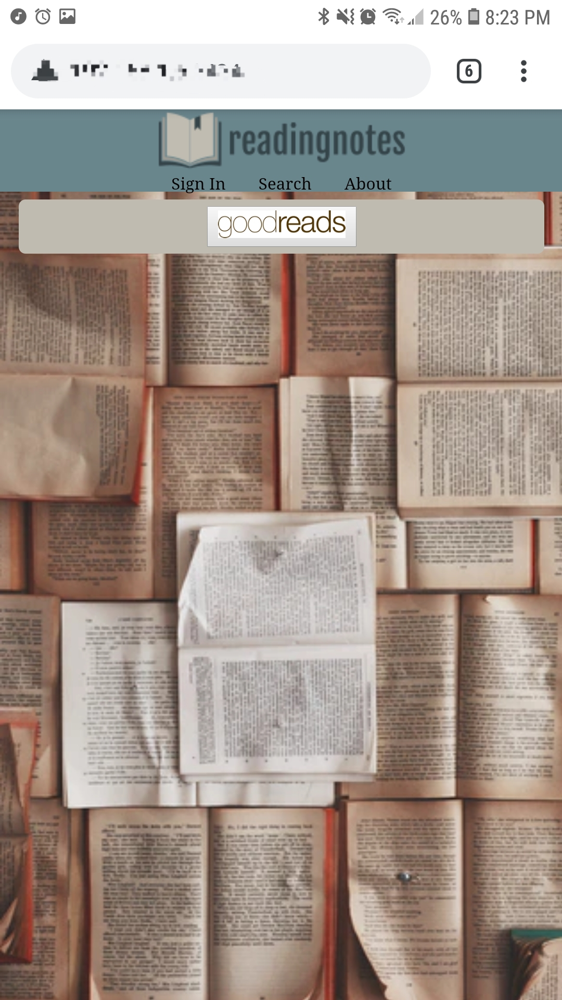
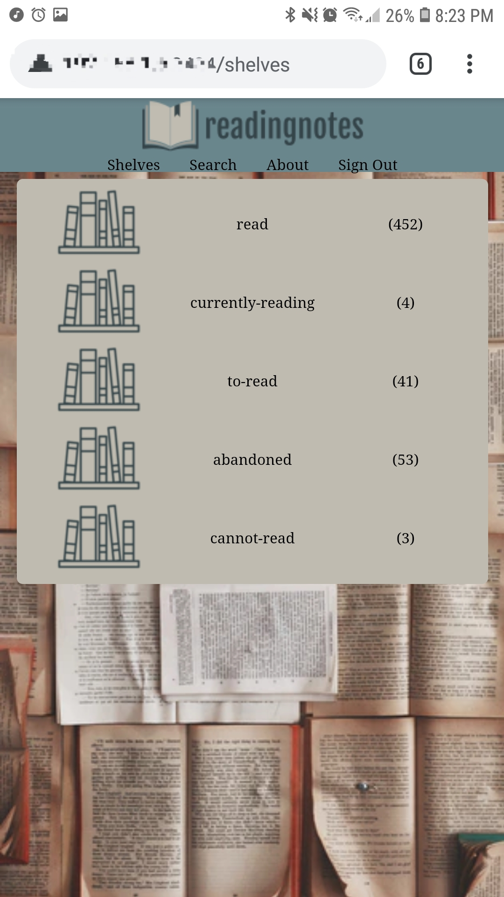
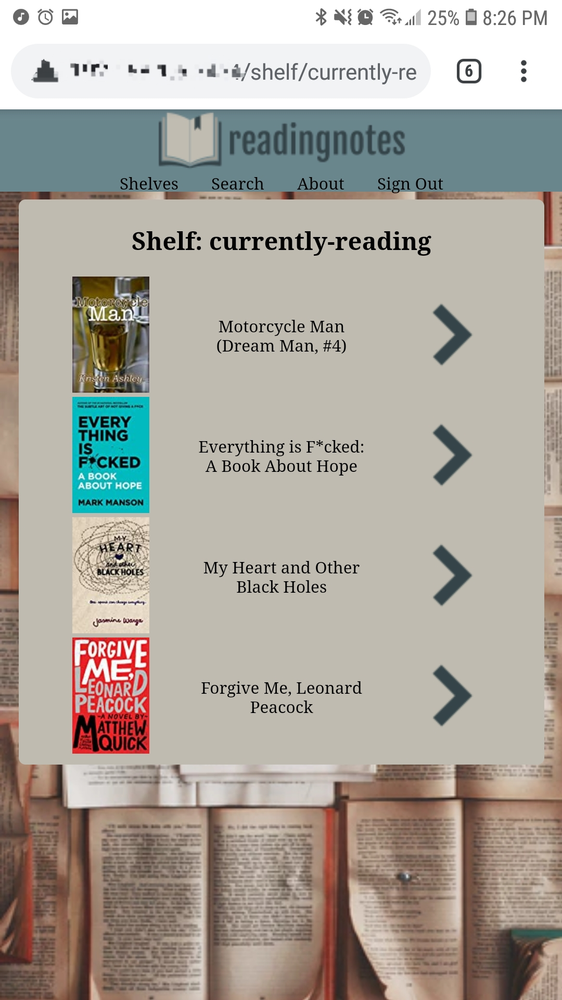
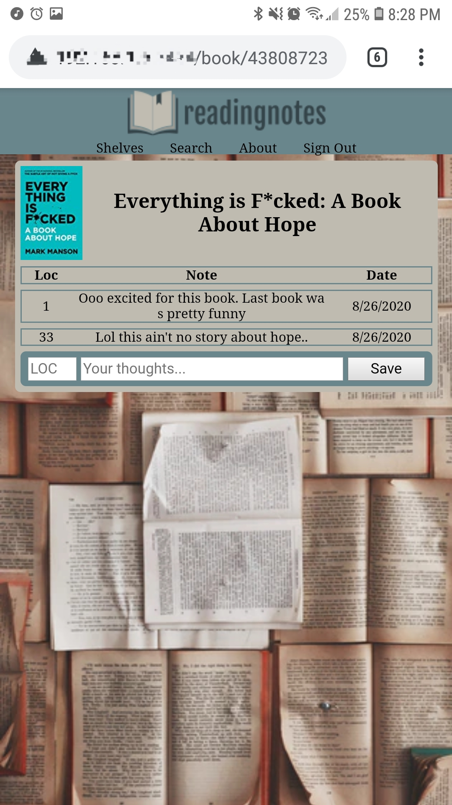
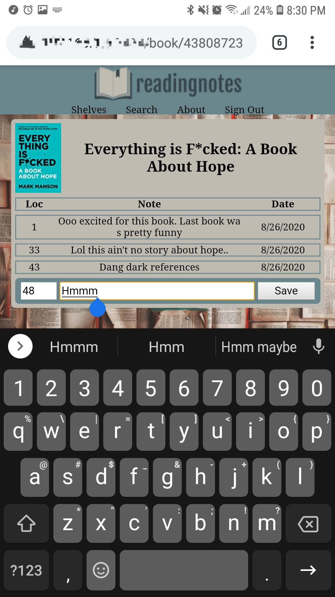

# ReadingNotes

A GoodReads companion application for you to jot down private notes about the books you're reading.

Sign in with your GoodReads account and view all of your shelves. Choose a shelf, then choose a book, and write your personal notes. Write about how you love this author and how they describe the setting so well. Or write about how much it irritates you that -. Write all your thought because these notes are just for you. You can look back on all your books and recall if you should pick up another book by that author.

# Views

